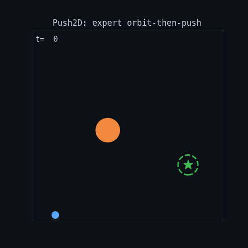
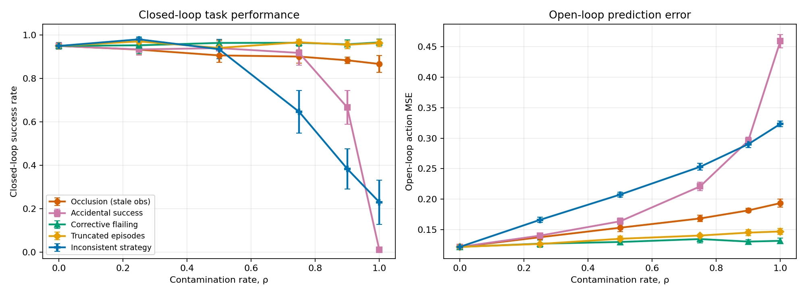
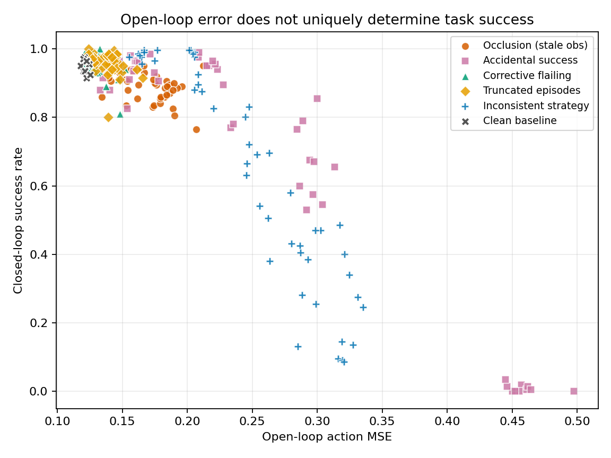

# Not All Bad Demonstrations Are Equally Bad

A controlled simulation study of how specific demonstration-quality failure
modes degrade closed-loop policy performance, and how badly open-loop
evaluation tracks that damage.

Fully code-based. No hardware, no robot time, no dataset licensing. The whole
grid (78 training runs) takes about 13 minutes on a laptop CPU.

**[Read the paper (PDF)](paper.pdf)** for the full writeup with figures,
tables and references. This README covers the same ground more briefly.

<p align="center">
  
</p>

<p align="center"><sub>The scripted expert orbiting to the staging point behind the block before pushing it to the goal. Generated by <code>make_demo_gif.py</code>.</sub></p>

---

## The question

Robot-learning work overwhelmingly treats *architecture* as the independent
variable. This treats **demonstration quality** as the independent variable
and holds everything else fixed: same environment, same policy architecture,
same hyperparameters, same dataset size, same evaluation initial conditions.

Two things get measured for every policy:

- **open-loop MSE**: action-prediction error against the expert on held-out
  *clean* expert states. Cheap, offline, no environment interaction.
- **closed-loop success rate**: actually run the policy and see if the block
  reaches the goal. Expensive, and the thing anyone actually cares about.

---

## Setup

**Task.** `Push2D`: a 2D block-pushing task, fully vectorized in numpy. Pushing
was chosen over reaching because it has a *staging* requirement: the gripper
must get behind the block before pushing, which makes compounding error
consequential. A policy that drifts during the approach ends up on the wrong
side and shoves the block *away* from the goal, unrecoverably. That is the
failure mode open-loop metrics are worst at surfacing.

**Expert.** A hand-coded orbit-then-push controller. Success rate: **100.0%**.

**Policy.** 2×256 MLP, MSE behaviour cloning, 50 epochs, 400 episodes
(~13k transitions). Identical across all runs; the model is not the point.

**Sweep axis: contamination rate ρ**, not per-episode severity. Every dataset
has the same number of episodes; ρ of them are bad, (1−ρ) are clean.
ρ ∈ {0, 0.25, 0.5, 0.75, 0.9, 1.0}, 3 seeds each.

### The five failure modes

| Mode | Implementation |
|---|---|
| **Occlusion** | Contiguous 35% window of observations frozen at last visible frame. Actions stay expert-quality; the demonstrator can see, the camera can't. |
| **Accidental success** | A controller that blindly charges the block, keeping only the ~6% of rollouts where the block happens to land on the goal. Right outcome, no correct behaviour anywhere. |
| **Corrective flailing** | Heavy jitter on the first 12 timesteps, then the demonstrator settles and still succeeds. Re-simulated, so the wobble genuinely happened. |
| **Truncation** | Episode cut at 70% and logged anyway, what a QC filter missing a premature stop looks like. |
| **Inconsistent strategy** | A second scripted strategy (always circle the same rotational direction, wider staging radius). Also **100.0%** reliable, so mixing tests inconsistency, not quality. |

**Two design decisions that matter:**

1. **Action-level corruptions are re-simulated, not pasted onto clean
   trajectories.** Overwriting actions in a logged episode without rerunning
   the dynamics produces observations that no longer follow from the actions,
   a physically impossible trajectory. That tests label noise, not bad
   demonstrations.
2. **Corrupted episodes must pass the same success-based QC filter a real
   pipeline would apply** (truncation excepted, since it *is* the filter
   failing). Otherwise you are measuring a filter you'd never ship without.

---

## Results



Clean baseline: **0.972** closed-loop success.

| Mode | ρ=0.5 | ρ=1.0 | Pearson r (MSE ↔ success) |
|---|---|---|---|
| Truncated episodes | 0.930 | 0.987 | −0.15 |
| Corrective flailing | 0.972 | 0.963 | −0.35 |
| Occlusion | 0.910 | 0.867 | −0.58 |
| Inconsistent strategy | 0.933 | 0.303 | −0.90 |
| Accidental success | 0.965 | **0.012** | −0.94 |

### 1. Failure modes are not interchangeable, and the ranking is not intuitive

At full contamination, corrective flailing costs ~1 point of success while
accidental success costs 96. These are both "bad demos" in any taxonomy.

**Corrective flailing is essentially free**, arguably mildly beneficial, since
jitter-then-recover trajectories provide DAgger-like off-distribution state
coverage. Filtering it out is wasted QC effort.

### 2. Accidental success is a cliff, not a slope

0.965 at ρ=0.5. 0.950 at ρ=0.75. **0.012 at ρ=1.0.**

This is the most operationally useful result here. Any meaningful fraction of
genuinely correct demonstrations masks the problem completely, right up until
it doesn't. A pipeline monitoring average success-labelled throughput sees
nothing coming.

### 3. Open-loop MSE looks predictive in aggregate and isn't, per mode

Pooled across all runs: **r = −0.91**. Convincing.

Broken out by failure mode: **−0.15 to −0.94**. For truncation and flailing the
offline metric carries essentially no signal about closed-loop behaviour.

Among the 15 runs whose open-loop MSE lands in [0.20, 0.30] (indistinguishable
on the offline metric), closed-loop success spans **0.315 to 0.980**.



---

## Where the prediction failed

The design predicted that mixing two valid strategies would cause
multimodal-averaging collapse. **The data does not support that**, and the
control is worth stating plainly:

At ρ=1.0 the dataset is 100% alternate-strategy and therefore fully
self-consistent; there is no mixing left to blame. Success there (0.303) is
the *clonability floor* of that strategy, not evidence of inconsistency harm.
Both experts solve the task 100% of the time; the alternate is simply ~3×
harder to clone (longer horizon, more orbit steps, more compounding error).

Reading intermediate ρ against the line joining the two endpoints:

| ρ | observed | clonability-only interpolation | excess harm from mixing |
|---|---|---|---|
| 0.25 | 0.972 | 0.805 | **+0.167** |
| 0.5 | 0.933 | 0.637 | **+0.296** |
| 0.75 | 0.728 | 0.470 | **+0.258** |
| 0.9 | 0.358 | 0.370 | −0.012 |

Excess harm is positive everywhere. Mixing strategies was *not* worse than the
clonability-weighted expectation; clean data protects rather than conflicts.
The inconsistent-strategy curve looks damaging only because one strategy is
intrinsically harder to imitate.

This matters for the headline claim: strip the inconsistent-strategy runs out
of the matched-MSE band and the spread narrows from 0.665 to about 0.22.
Real, but a much more modest result than the raw number suggests.

---

## Caveats worth stating before publishing

- **3 seeds is thin.** Some cells are noisy: occlusion at ρ=1.0 spans 0.735
  to 0.955 across seeds. 10 seeds before any claim gets quoted with a number.
- **2D toy environment.** Whether these rankings survive in a 7-DOF setting
  with contact dynamics and visual observations is open. This proves the
  methodology, not the numbers.
- **Alternate-strategy episodes are longer**, so at fixed episode count they
  contribute more transitions. A transition-matched replication would tighten
  the inconsistent-strategy arm further.
- **One policy class.** MSE regression averages multimodal action
  distributions by construction; a diffusion or flow-matching policy might
  handle the inconsistent-strategy case very differently. That is the single
  most interesting follow-up.

---

## Repository layout

```
demo-quality-robustness/
├── README.md                 you are here
├── LICENSE                   MIT
├── CITATION.cff              so the repo is citable (GitHub renders a "Cite this" button)
├── requirements.txt
├── .gitignore
│
├── env2d.py                  vectorized Push2D environment + the three scripted controllers
├── corruptions.py            the five corruption modes and dataset assembly
├── policy.py                 BC policy, training loop, both evaluations
├── run_experiment.py         grid runner        →  results/results.csv
├── analyze.py                stats and figures  →  results/findings.md, results/*.png
├── make_demo_gif.py          renders one expert episode →  results/demo.gif
│
├── paper/
│   ├── paper.tex             LaTeX source (two-column, self-contained, no bibtex)
│   └── paper.pdf             compiled 4-page paper
│
└── results/                  committed, so the repo is readable without running anything
    ├── results.csv           raw per-run results (93 rows: mode, ρ, seed, both metrics)
    ├── findings.md           generated statistics tables
    ├── fig1_dose_response.png
    ├── fig2_openloop_vs_closedloop.png
    └── demo.gif
```

The three modules are import-only, no side effects, so anyone can pull just
`env2d.py` and `corruptions.py` to reuse the environment or the corruption
functions independently of the rest.

**Commit `results/`.** It is a few hundred KB and it means the repo makes its
point to someone reading it in a browser, without a clone, an install, or 13
minutes of CPU.

## Reproducing

```bash
git clone https://github.com/<user>/demo-quality-robustness
cd demo-quality-robustness
pip install -r requirements.txt

python run_experiment.py   # ~13 min on a laptop CPU, writes results/results.csv
python analyze.py          # writes results/findings.md and both figures
```

Seeds are fixed (`SEEDS = [0, 1, 2]` in `run_experiment.py`) and evaluation
initial conditions are pinned to a single seed shared across every config, so
runs are deterministic given the same PyTorch version. Results here were
produced with torch 2.13 / numpy 2.4 on CPU; minor numeric drift across torch
versions is expected and should not move any conclusion.

To rebuild the paper (requires a LaTeX distribution; figures are pulled from
`results/` by relative path, so compile from inside `paper/`):

```bash
cd paper && pdflatex paper.tex && pdflatex paper.tex
```

To change the sweep, edit the constants at the top of `run_experiment.py`
(`N_EPISODES`, `EPOCHS`, `RHOS`, `SEEDS`). Per-episode corruption severity
lives at the top of `corruptions.py`.
