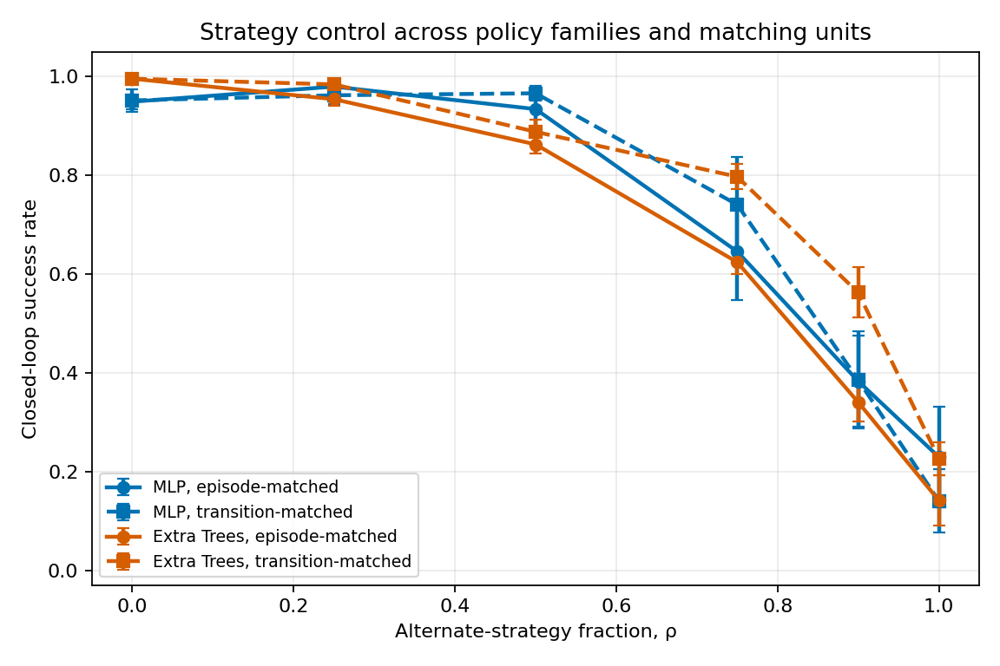

# Not All Bad Demonstrations Are Equally Bad

A controlled simulation study of how specific demonstration-quality failure
modes degrade closed-loop policy performance, and how badly open-loop
evaluation tracks that damage.

Fully code-based. No hardware, robot time, or dataset licensing. The release
contains 640 policy fits: two 260-fit main sweeps and 120 transition-matched
controls, all across ten paired training/evaluation seeds.

**[Read the paper (PDF)](paper.pdf)** for the full writeup with figures,
tables and references. This README covers the same ground more briefly.

<p align="center">
  
</p>

<p align="center"><sub>The scripted expert orbiting to the staging point behind the block before pushing it to the goal. Generated by <code>make_demo_gif.py</code>.</sub></p>

---

## The question

Robot-learning work overwhelmingly treats *architecture* as the independent
variable. This treats **demonstration quality** as the independent variable
and holds the task, training protocol, dataset size, and paired evaluation
conditions fixed. The full sweep is repeated for two policy families.

Two things get measured for every policy:

- **open-loop MSE**: action-prediction error against the expert on held-out
  *clean* expert states. Cheap, offline, no environment interaction.
- **closed-loop success rate**: actually run the policy and see if the block
  reaches the goal. Expensive, and the thing anyone actually cares about.

---

## Setup

**Task.** `Push2D`: a 2D block-pushing task, fully vectorized in numpy. Pushing
was chosen over reaching because it has a *staging* requirement: the gripper
must get behind the block before pushing, which makes compounding error
consequential. A policy that drifts during the approach ends up on the wrong
side and shoves the block *away* from the goal, unrecoverably. That is the
failure mode open-loop metrics are worst at surfacing.

**Expert.** A hand-coded orbit-then-push controller. Success rate: **100.0%**.

**Policies.** A 2×256 MLP trained by MSE behaviour cloning for 50 epochs and
an Extra Trees regressor with 40 trees. Both use the same 400-episode datasets.

**Sweep axis: contamination rate ρ**, not per-episode severity. Every dataset
has the same number of episodes; ρ of them are bad, (1−ρ) are clean.
ρ ∈ {0, 0.25, 0.5, 0.75, 0.9, 1.0}, with ten seeds each. A separate strategy
control fixes 13,000 total transitions and defines ρ at transition level.

### The five failure modes

| Mode | Implementation |
|---|---|
| **Occlusion** | Contiguous 35% window of observations frozen at last visible frame. Actions stay expert-quality; the demonstrator can see, the camera can't. |
| **Accidental success** | A controller that blindly charges the block, keeping only the ~6% of rollouts where the block happens to land on the goal. Right outcome, no correct behaviour anywhere. |
| **Corrective flailing** | Heavy jitter on the first 12 timesteps, then the demonstrator settles and still succeeds. Re-simulated, so the wobble genuinely happened. |
| **Truncation** | Episode cut at 70% and logged anyway, what a QC filter missing a premature stop looks like. |
| **Inconsistent strategy** | A second scripted strategy (always circle the same rotational direction, wider staging radius). Also **100.0%** reliable, so mixing tests inconsistency, not quality. |

**Two design decisions that matter:**

1. **Action-level corruptions are re-simulated, not pasted onto clean
   trajectories.** Overwriting actions in a logged episode without rerunning
   the dynamics produces observations that no longer follow from the actions,
   a physically impossible trajectory. That tests label noise, not bad
   demonstrations.
2. **Corrupted episodes must pass the same success-based QC filter a real
   pipeline would apply** (truncation excepted, since it *is* the filter
   failing). Otherwise you are measuring a filter you'd never ship without.

---

## Results


MLP clean baseline: **0.949 ± 0.015** closed-loop success (mean ± 95% t-interval
half-width). Extra Trees clean baseline: **0.996 ± 0.003**.

| Mode | ρ=0.5 | ρ=1.0 | Pearson r (MSE ↔ success) |
|---|---|---|---|
| Truncated episodes | 0.940 | 0.962 | −0.13 |
| Corrective flailing | 0.963 | 0.965 | −0.26 |
| Occlusion | 0.905 | 0.866 | −0.64 |
| Inconsistent strategy | 0.934 | 0.229 | −0.89 |
| Accidental success | 0.939 | **0.009** | −0.95 |

### 1. Failure modes are not interchangeable, and the ranking is not intuitive

At full contamination, the MLP's paired change from clean is **+0.016 ±
0.022** for corrective flailing and **−0.940 ± 0.020** for accidental success.
These are both "bad demos" in a practical taxonomy.

**Corrective flailing causes no detectable loss here.** Jitter-then-recover
trajectories may provide DAgger-like off-distribution state coverage, but the
paired interval includes zero change and does not establish a benefit.

### 2. Accidental success is a cliff, not a slope

0.939 at ρ=0.5. 0.917 at ρ=0.75. **0.009 at ρ=1.0.**

This is the most operationally useful result here. Any meaningful fraction of
genuinely correct demonstrations masks the problem completely, right up until
it doesn't. A pipeline monitoring average success-labelled throughput sees
nothing coming.

### 3. Open-loop MSE looks predictive in aggregate and isn't, per mode

Pooled across all 260 MLP fits: **r = −0.92**.

Broken out by failure mode: **−0.13 to −0.95**. For truncation and flailing the
offline metric carries essentially no signal about closed-loop behaviour.

Among the 49 runs whose open-loop MSE lands in the descriptive band
[0.20, 0.30], closed-loop success spans **0.130 to 0.995**. This illustrates
similar numerical scores; it is not a statistical equivalence test.


---

## Robustness controls

### Policy family changes the middle of the ranking

| Mode at ρ=1.0 | MLP success | Extra Trees success |
|---|---:|---:|
| Corrective flailing | 0.965 ± 0.015 | 0.993 ± 0.007 |
| Truncated episodes | 0.962 ± 0.017 | 0.614 ± 0.033 |
| Occlusion | 0.866 ± 0.038 | 0.990 ± 0.006 |
| Inconsistent strategy | 0.229 ± 0.102 | 0.142 ± 0.050 |
| Accidental success | **0.009 ± 0.008** | **0.002 ± 0.003** |

Accidental success remains catastrophic and corrective flailing remains
benign. Occlusion and truncation exchange rank across policies, so quality-
control priorities must account for the intended learner.

### Transition matching rejects the strategy-conflict explanation

At ρ=1.0 the alternate-strategy dataset is fully self-consistent; its low
success is a clonability floor, not evidence of mixing harm. The additional
control fixes every dataset at 13,000 transitions and makes ρ the exact
alternate-strategy transition fraction. For both policies, every intermediate
mixture performs above the line connecting its two endpoints.



The apparent inconsistent-strategy penalty is therefore dominated by the
alternate strategy's lower clonability, not by conflict between strategies.

---

## Limitations

- **Controlled 2D simulation.** The study isolates mechanisms; it does not
  establish transferable numerical thresholds for 7-DOF or vision-based work.
- **Two deterministic regressors.** MLP and Extra Trees cover different
  inductive biases, but generative policies may behave differently.
- **Finite evaluation coverage.** Ten paired seeds and 200 evaluation episodes
  per fit improve precision without exhausting the simulator distribution.
- **Exploratory analysis.** The MSE band was not preregistered, and intervals
  are not adjusted for multiple comparisons.
- **Scripted defects.** Exact programmatic control does not capture every
  temporal dependency present in human demonstrations.

---

## Repository layout

```
demo-quality-robustness/
├── README.md                 you are here
├── LICENSE                   MIT
├── CITATION.cff              so the repo is citable (GitHub renders a "Cite this" button)
├── requirements.txt
├── .gitignore
│
├── env2d.py                  vectorized Push2D environment + the three scripted controllers
├── corruptions.py            the five corruption modes and dataset assembly
├── policy.py                 MLP + Extra Trees policies and evaluations
├── run_experiment.py         main grid runner
├── run_controls.py           transition-matched strategy controls
├── analyze.py                stats and figures  →  results/findings.md, results/*.png
├── make_demo_gif.py          renders one expert episode →  results/demo.gif
│
├── paper.tex                 LaTeX source (two-column, self-contained, no bibtex)
├── paper.pdf                 compiled paper
│
└── results/                  committed, so the repo is readable without running anything
    ├── results.csv           MLP results (310 rows; 260 independent fits)
    ├── results_tree.csv      Extra Trees results (same design)
    ├── control_results.csv   120 transition-matched control fits
    ├── findings.md           generated statistics tables
    ├── fig1_dose_response.png
    ├── fig2_openloop_vs_closedloop.png
    ├── fig3_strategy_controls.png
    └── demo.gif
```

The three modules are import-only, no side effects, so anyone can pull just
`env2d.py` and `corruptions.py` to reuse the environment or the corruption
functions independently of the rest.

**Commit `results/`.** It is a few hundred KB and it means the repo makes its
point to someone reading it in a browser without a clone or an install.

## Reproducing

```bash
git clone https://github.com/<user>/demo-quality-robustness
cd demo-quality-robustness
pip install -r requirements.txt

python run_experiment.py --policy mlp --out results/results.csv
python run_experiment.py --policy trees --out results/results_tree.csv
python run_controls.py
python analyze.py          # findings.md and all three figures
```

Training seeds are fixed at 0–9. Evaluation seed `12345 + s` is used for
training seed `s`, so evaluation states vary across seeds while remaining
paired across configurations. Results are deterministic given the same
dependency versions; minor floating-point drift across platforms is expected.

To rebuild the paper (requires a LaTeX distribution; compile from the
repository root):

```bash
pdflatex paper.tex && pdflatex paper.tex
```

To change the sweep, edit the constants at the top of `run_experiment.py`
(`N_EPISODES`, `EPOCHS`, `RHOS`, `SEEDS`). Per-episode corruption severity
lives at the top of `corruptions.py`.
